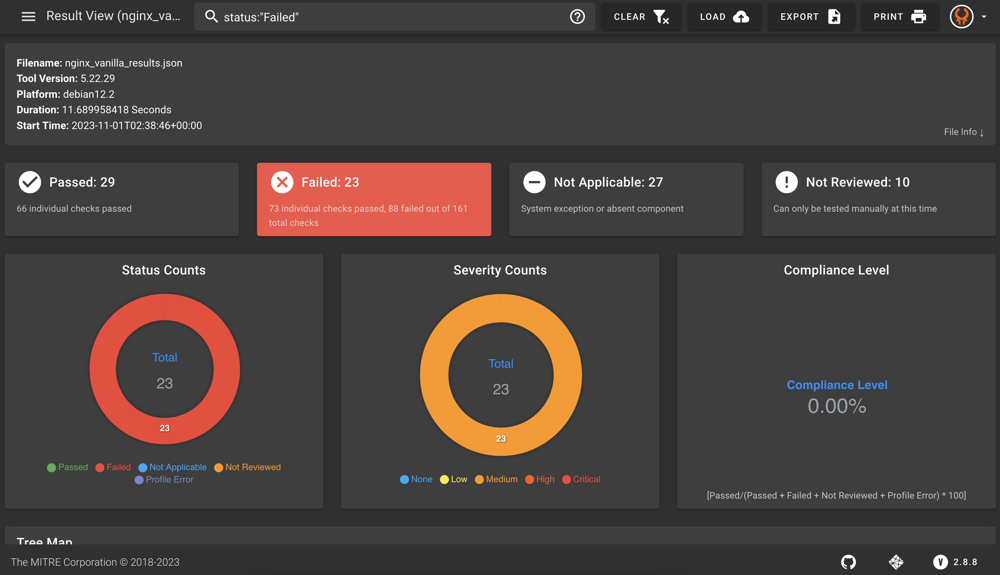
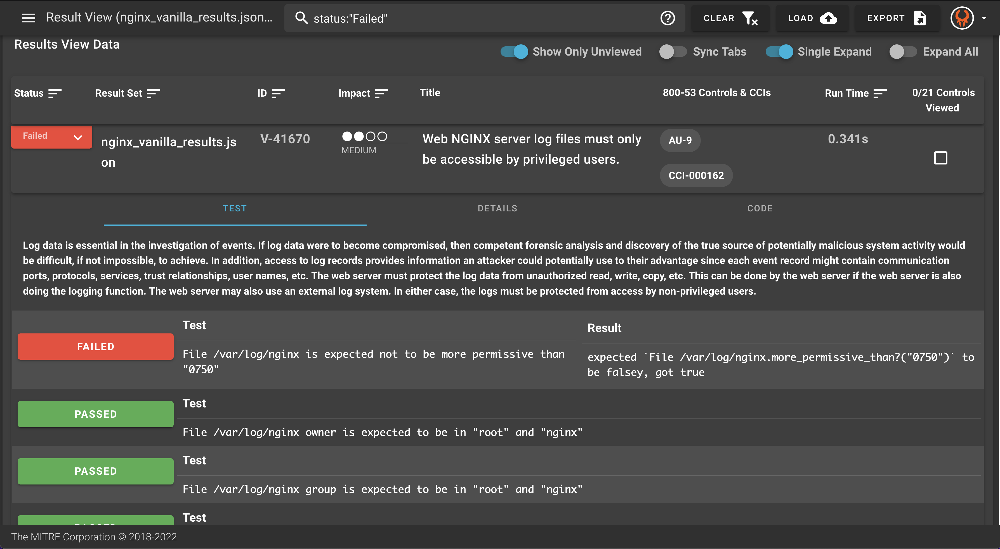

## 9. Visualize - MITRE Heimdall

Now we want to SEE our results in a more meaningful way!


Navigate to the our online version of the Heimdall application, the visualization tool, [Heimdall Lite](https://heimdall-lite.mitre.org/).

### 9.1 Upload Results
Click on the button `Upload` and navigate to your json output file that you saved from your previous step and select that file then click open.

This will allow you to view the InSpec results in the Heimdall viewer.


### 9.2 Visualize Results

Your visualization should look similar to the following:


### 9.3 Explore Heimdall

Heimdall can allow you to see a lot of different information based on the available data. See if you can find the following information from your uploaded results!

::: details What is the overall compliance level?
In this example, the overall compliance is 46.77%. As you can see, the compliance formula is written in the GUI. This is the number of passed controls divided by the total passed, failed, not reviewed, and errors. Not Applicable controls are not included in the overall compliance total.
:::

::: details Can you filter to just the failures?
You can interact with many different icons to filter for the specific results you want to see. For example, you can filter on the status, you can filter from the the severity level, you can filter from the search bar at the top, or you can filter using the tree map as some ways to drill down on a particular category or control. Here is a view of filtering with for failures.

:::

::: details How do you know which NIST 800-53 control is failing?
How can expand different sections of the NIST SP 800-53 Control Tree Map to see your coverage based on the NIST controls. In this image, the filter on failed controls is still applied, but you can clear that filter to see the overall tree map for your system.

:::

::: details Can you find the reason for a failure? For example, V-41670?
As you continue to scroll down, you can see the Results View Data. You can expand the results for a given control to see the individual subcontrols or subtests that were run to test the requirement. If any subtests fail, the control overall will be recorded as a failed control. In this case, we can see that a subtest looking at the permission of the `/var/log/nginx` file was more permissive than it should be to meet the security requirements.

:::

::: details Where can you find information on how to fix a failed control? For example, V-41670?
You can click on the "Details" or "Code" tab to see more information about how to check or fix a particular control. In this case, the fix text is written as follows:
```
Fix:

To protect the integrity of the data that is being captured in the
  log files, ensure that only the members of the Auditors group, Administrators,
  and the user assigned to run the web server software is granted permissions to
  read the log files.
```

:::

::: details How can you see information about the results file, such as the run date or the platform this scan was run on?
You can view file information by clicking "File Info" on the top of the application where the file name is listed. This can show you things like the platform that this scan was completed on, how long it took, the date of the scan, and more. If you click on the "Inputs" tab, this will show what values were used for different variables in the profile's automated tests. This will show the inputs that we specified in the inputs file, and the default values for any variables that we did not put in the inputs file.

:::
