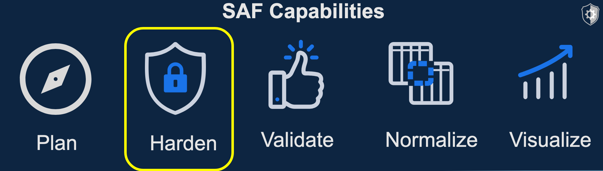
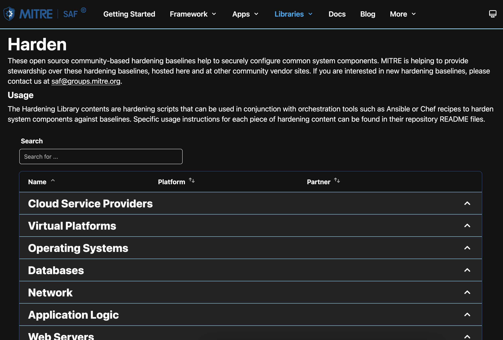

## 10. From "Plan" to "Validate" to "Visualize" to "Harden"

Finally! We get to secure the software. After starting with a plan, then seeing the requirements and current state through validation and visualiztion, let's harden the component and revalidate it after the changes.



### 10.1 Find the hardening content

Remember when you perused the hardening content on the SAF site when we talked about the "Plan" pillar? This is where we will find automated content for configuring a software component to some guidance. In this case, we will use the NGINX Stigready Content on the [saf hardening page](https://saf.mitre.org/#/harden).



You could peruse this GitHub repository, including the README and inputs to find out more information, but for this training, we have put any preparation needed for running this hardening content into a pre-script.

### 10.2 Prepare your Codespaces to run the hardening script

Just like we saw some requirements for running an InSpec scan, there are also some requirements to run the hardening script on the NGINX container in your Codespaces. We are going to run another setup script for those. 

In your Codespace terminal from your main workspace directory, run the following commands:

```sh
source ./install-nginxHardeningTools.sh
```

This command will make sure that the NGINX docker container has the required software dependencies such as Python to run the Ansible hardening content. This script also downloads the hardening content locally. Unlike the InSpec scan, we will run the hardening content from a local folder rather than from GitHub. Therefore, you should see the `ansible-nginx-stigready-hardening` folder in your files when the script completes.


### 10.3 CLI Results of Hardening Script

You should see the following results from the hardening script. If you run this hardening content multiple times, the numbers in the results may be different because the starting configuration will be different and the script will not have to change the same numbers of settings.

::: note 
Make sure you are in the ansible content's directory before running the following command. You can run the command
 `cd ansible-nginx-stigready-hardening`
 to enter the directory. That means your current working directory path will look something like `/workspaces/saf-training-lab-environment/ansible-nginx-stigready-hardening` with variation if you named your repository differently in the lab setup.
 :::

Run this command:
```sh
ansible-playbook -i hosts.yml hardening-playbook.yml
```

To see the following results:
```sh
ansible-playbook -i hosts.yml hardening-playbook.yml 
[WARNING]: Ansible is being run in a world writable directory (/workspaces/saf-training-lab-environment/ansible-nginx-stigready-hardening), ignoring
it as an ansible.cfg source. For more information see https://docs.ansible.com/ansible/devel/reference_appendices/config.html#cfg-in-world-writable-
dir

PLAY [all] ******************************************************************************************************************************************

TASK [Gathering Facts] ******************************************************************************************************************************
ok: [docker]

TASK [../ansible-nginx-stigready-hardening : Ensure the "/usr/sbin/nginx" binary is not worldwide read- or writeable] *******************************
changed: [docker]

...

TASK [../ansible-nginx-stigready-hardening : Generate a '/C=US/O=U.S. Government/OU=DoD/CN=DoD' self-signed ssl certificate and key] ****************
changed: [docker]

TASK [../ansible-nginx-stigready-hardening : Ensure the private key is only readable by 'root'] *****************************************************
changed: [docker]

TASK [../ansible-nginx-stigready-hardening : Ensure the crt should only be readable by 'root'] ******************************************************
changed: [docker]

TASK [../ansible-nginx-stigready-hardening : Post Task] *********************************************************************************************
changed: [docker]

PLAY RECAP ******************************************************************************************************************************************
docker                     : ok=38   changed=35   unreachable=0    failed=0    skipped=0    rescued=0    ignored=0  
```
