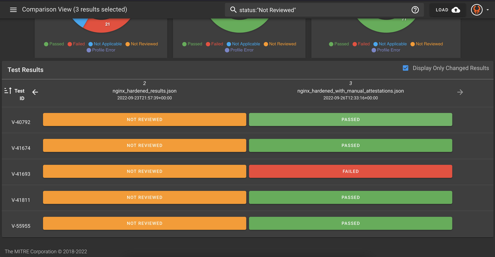

## 12. Manual Attestations

What about controls that cannot be automated and require manual review? You may have noticed that Heimdall displays controls in 4 statuses: `Passed`, `Failed`, `Not Applicable`, and `Not Reviewed`.

Controls may be `Not Reviewed` for multiple reasons. One major reason is that the control requires manual review. You can explore the details of the `Not Reviewed` controls to find out more.

### 12.1 Explore the Not Reviewed Controls

Look at the hardened results again in Heimdall. Go back to the menu in the top left to toggle off "Comparison View" and select on the hardened results.


Scroll down to see the details and learn why the controls were not reviewed.


You can see that for various reasons, many of these controls require manual review. If someone does that manual review, how can we show that in the data?

### 12.2 Manual Attestations Using SAF CLI

You have already seen the InSpec profiles and the Heimdall application that the SAF provides. Another feature of the SAF is the SAF CLI. This is a command line utility tool that helps with various steps in the security automation process. You can see all of the SAF CLI's capability [here](https://saf-cli.mitre.org/), but we will look more at how we can use it to add manual attestation data to our overall results.

### 12.3 Get Familiar with SAF CLI

SAF CLI has been downloaded into your Codespaces lab environmnet, so it is available for you to use on the command line. Try out a few commands to see what you can do!

::: code-tabs

@tab Command
```sh
saf --version
```
@tab Output
```sh
@mitre/saf/1.2.34 linux-x64 node-v20.8.1
```
:::

The help command will give you the information on how to use the SAF CLI:
::: code-tabs

@tab Command
```sh
saf help
```
@tab Output
```sh
The MITRE Security Automation Framework (SAF) Command Line Interface (CLI) brings together applications, techniques, libraries, and tools developed by MITRE and the security community to streamline security automation for systems and DevOps pipelines.

VERSION
  @mitre/saf/1.2.34 linux-x64 node-v20.8.1

USAGE
  $ saf [COMMAND]

TOPICS
  attest      [Attest]       Attest to 'Not Reviewed' control requirements (that can’t be tested automatically by security tools and hence require manual review), helping to account for all requirements
  convert     [Normalize]    Convert security results from all your security tools between common data formats
  emasser     [eMASS]        The eMASS REST API implementation
  generate    [Generate]     Generate pipeline thresholds, configuration files, and more
  harden      [Harden]       Implement security baselines using Ansible, Chef, and Terraform content: Visit https://saf.mitre.org/#/harden to explore and run hardening scripts
  plugins     List installed plugins.
  scan        [Scan]         Scan to get detailed security testing results: Visit https://saf.mitre.org/#/validate to explore and run inspec profiles
  supplement  [Supplement]   Supplement (ex. read or modify) elements that provide contextual information in the Heimdall Data Format results JSON file such as `passthrough` or `target`
  validate    [Validate]     Verify pipeline thresholds
  view        [Visualize]    Identify overall security status and deep-dive to solve specific security defects

COMMANDS
  convert   The generic convert command translates any supported file-based security results set into the Heimdall Data Format
  harden    Visit https://saf.mitre.org/#/harden to explore and run hardening scripts
  heimdall  Run an instance of Heimdall Lite to visualize your data
  help      Display help for saf.
  plugins   List installed plugins.
  scan      Visit https://saf.mitre.org/#/validate to explore and run inspec profiles
  summary   Get a quick compliance overview of an HDF file
  version
```
:::

You can use the `-h` flag to get more information on the different topics and commands.

::: code-tabs

@tab Command
```sh
saf attest -h
```

@tab Output
```sh
[Attest]       Attest to 'Not Reviewed' control requirements (that can’t be tested automatically by security tools and hence require manual review), helping to account for all requirements

USAGE
  $ saf attest COMMAND

COMMANDS
  attest apply   Apply one or more attestation files to one or more HDF results sets
  attest create  Create attestation files for use with `saf attest apply`
```
:::

### 12.4 Create Manual Attestation Data

After someone on your team completes the manual check that is required for your security control, record that information with the help of the SAF CLI.

First, look at the flags for the `saf attest create` command.

::: code-tabs

@tab Command
```sh
saf attest create -h
```

@tab Output
```sh
Create attestation files for use with `saf attest apply`

USAGE
  $ saf attest create -o <attestation-file> [-i <hdf-json> -t <json | xlsx | yml | yaml>]

FLAGS
  -h, --help             Show CLI help.
  -i, --input=<value>    (optional) An input HDF file to search for controls
  -o, --output=<value>   (required) The output filename
  -t, --format=<option>  [default: json] (optional) The output file type
                         <options: json|xlsx|yml|yaml>

DESCRIPTION
  Create attestation files for use with `saf attest apply`

EXAMPLES
  $ saf attest create -o attestation.json -i hdf.json

  $ saf attest create -o attestation.xlsx -t xlsx
```
:::

Here is an example of an attested control that we can create based on 
1. The results we saw in Heimdall
2. Our (hypothetical) completed manual check (Let's pretend that we did check this!)

```sh
saf attest create -o ./results/manual_attestation_results.json
Enter a control ID or enter 'q' to exit: V-40792
Attestation explanation: Verified that the server-side session management is configured correctly.
Frequency (1d/3d/1wk/2wk/1m/3m/6m/1y/1.5y/custom): 3m
Enter status ((p)assed/(f)ailed): p
Updated By: Emily Rodriguez
Enter a control ID or enter 'q' to exit: 
```

Now, go through and add more attestations of the Not Reviewed results. You can decide if they should pass or fail as if you hypothetically did check these controls manually. Type `q` when you are done.

### 12.5 Apply the Manual Attestation Data

Use the `-h` flag to learn about applying attestations.

::: code-tabs

@tab Command
```sh
saf attest apply -h
```

@tab Output
```sh
Apply one or more attestation files to one or more HDF results sets

USAGE
  $ saf attest apply -i <input-hdf-json>... <attestation>... -o <output-hdf-path>

FLAGS
  -h, --help              Show CLI help.
  -i, --input=<value>...  (required) Your input HDF and Attestation file(s)
  -o, --output=<value>    (required) Output file or folder (for multiple executions)

DESCRIPTION
  Apply one or more attestation files to one or more HDF results sets

EXAMPLES
  $ saf attest apply -i hdf.json attestation.json -o new-hdf.json

  $ saf attest apply -i hdf1.json hdf2.json attestation.xlsx -o outputDir
```
:::

Apply the attestation like this:

```sh
saf attest apply -i ./results/nginx_hardened_results.json ./results/manual_attestation_results.json -o ./results/nginx_hardened_with_manual_attestations.json
```

### 12.6 Visualize the Results - Heimdall

As we have done before,
1. Download the `nginx_hardened_with_manual_attestations.json` file.
2. Upload this file to Heimdall.
3. Click on the top left menu and toggle on the Comparison View
4. Compare the results.

In the example, a few manual attestations were completed, some of which were recorded as passing and some as failing. You may have chosen to do your manual attestations differently and have different metrics.


You can look at the details to find the attestation information captured. Expand the details for each control to view this data.

