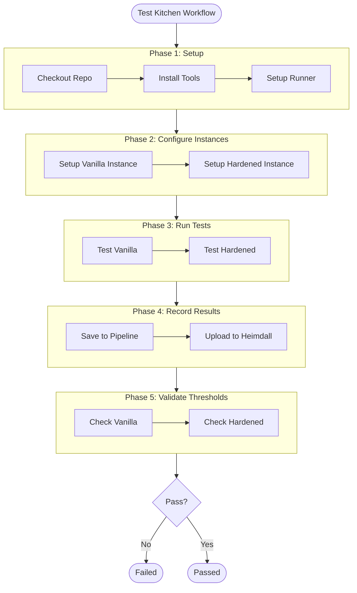

## Learning Objectives

By the end of this module, you will be able to:

- Understand the purpose and benefits of Test Kitchen
- Describe the Test Kitchen workflow
- Differentiate between vanilla and hardened configurations
- Execute basic Test Kitchen commands

## What is Test Kitchen?

Test Kitchen is a powerful testing framework that allows developers to test infrastructure code across different platforms and configurations. Think of it as a laboratory where you can safely experiment with different system configurations without affecting your production environment.

## Test Kitchen Workflow

The testing process follows four key stages:

1. **Create** 🏗️
   - Spins up a fresh instance of your target platform
   - Sets up the basic environment

2. **Converge** 🔄
   - Applies your infrastructure code
   - Configures the instance according to your specifications

3. **Verify** ✅
   - Runs your tests against the instance
   - Checks if everything is configured correctly

4. **Destroy** 🧹
   - Cleans up the test environment
   - Removes the instance completely

## Testing Configurations

We use two main testing configurations:

### Vanilla Configuration

- Stock installation with default settings
- No customization or hardening
- Represents "out-of-the-box" state
- Used as a baseline for comparison

### Hardened Configuration

- Implements security best practices
- Follows benchmark recommendations (e.g., RHEL V1R12)
- Represents the target secure state
- Applied during the converge phase

## Behind the Scenes: System Access

To enable testing, Test Kitchen makes minimal system modifications:

- Adds SSH private key authentication
- Sets up appropriate access protocols:
  - SSH for Unix/Linux systems
  - WinRM for Windows systems

## Where do we put it?

We put our Test Kitchen code that we use to assess our InSpec code in the same repository.  The example that we will be working through for the next few sections will use the [RHEL 9 InSpec repository](https://github.com/mitre/redhat-enterprise-linux-9-stig-baseline).
