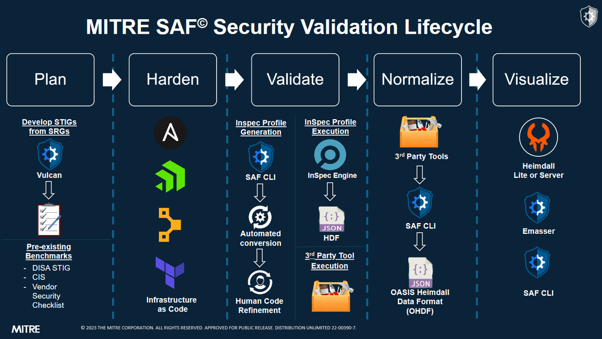

## A Look Ahead

In this section, we will cover:

- Where OHDF is used:
  - [The Security Automation Framework](#what-is-the-security-automation-framework)
  - [InspecJS](#what-is-inspecjs)
  - [OHDF Converters](#what-is-ohdf-converters)
  - [The SAF CLI](#what-is-the-saf-cli)
  - [Heimdall](#what-is-heimdall)

## Where Is OHDF Used?

OHDF is a cornerstone of the Security Automation Framework and is officially implemented and used in a plethora of tools and libraries including InspecJS, OHDF Converters, the SAF CLI, and Heimdall.

### What Is the Security Automation Framework?

The Security Automation Framework (SAF) is a suite of open-source security automation tools that facilitate the development, collection, and standardization of content for use by government and industry organizations to​:

- Accelerate ATO.
- Establish security requirements.
- Build security in.
- Assess/monitor vulnerabilities.

SAF has five core capabilities, of which OHDF is involved in varying degrees:

- **Plan**: OHDF is defined such that it includes all information described in the guidance, as well as relevant metadata. Thus, the information provided by the guidance is incorporated with the security tool results.

- **Harden**: OHDF is not typically used in this capability.

- **Validate**: InSpec's results format is a subset of the OHDF, meaning that InSpec is natively supported. Moreover, it's easy to write InSpec such that all the guidance information is passed through into both the OHDF profile and OHDF results formats.

- **Normalize**: With the use of OHDF Converters, we are able to map many different security result formats to our standard format, OHDF. These converters can either be accessed directly or via the SAF CLI.

- **Visualize**: OHDF is ingested by a variety of tools and transformed in many different ways. For example, a results file can be turned into a threshold file for pipeline use, turned into a POAM for ingestion by eMASS, or ingested by Heimdall directly for display purposes.

You can read more about SAF [here](../user/03.md).

### What Is InspecJS?

[InspecJS](https://github.com/mitre/heimdall2/tree/master/libs/inspecjs) is a library that provides schema definitions, classes, and utilities for OHDF file handling. InspecJS plays a pivotal role in the contextualization process where it performs tasks such as converting the individual statuses for each finding into an overall status for the requirement/control.

### What Is OHDF Converters?

[OHDF Converters](https://github.com/mitre/heimdall2/tree/master/libs/hdf-converters) is a custom data normalization library which hosts and leverages OHDF mappers for transforming various security data formats to and from OHDF. It is currently integrated in tools such as [Heimdall](https://github.com/mitre/heimdall2) and the [SAF CLI](https://github.com/mitre/saf), which collectively are part of the [Security Automation Framework (SAF)](https://saf.mitre.org/#/), a set of tools and processes which aim to standardize and ease security testing and verification for systems such as automated build pipelines.

### What Is the SAF CLI?

The Security Automation Framework Command Line Interface (SAF CLI) brings together applications, techniques, libraries, and tools developed by MITRE and the security community to streamline security automation for systems and DevOps pipelines.

One use case for the SAF CLI is automating certain security processes in a CI/CD pipeline. For instance, you can set up the SAF CLI to automatically ingest security reports generated from the build pipeline, normalize the security data into OHDF using the `saf convert` command, and then forward the newly generated OHDF files to a visualization tool such as Heimdall that allows a security assessor to review the state of the current software build.

### What Is Heimdall?

[Heimdall](https://github.com/mitre/heimdall2) is a visualization tool that provides a GUI-based means for managing and analyzing security data. Data that is imported into Heimdall is automatically converted to OHDF through OHDF Converters, which serves as the underlying library that services data format conversion requests in Heimdall.

## A Look Back

In this section, we covered:

- Where OHDF is used:

  - [The Security Automation Framework](#what-is-the-security-automation-framework)

    - The Security Automation Framework is a suite of open-source security automation tools that facilitate the development, collection, and standardization of content. OHDF is an integral data format used in many of these SAF tools.

  - [InspecJS](#what-is-inspecjs)

    - InspecJS is a library that provides schema definitions, classes, and utilities for OHDF file handling.

  - [OHDF Converters](#what-is-ohdf-converters)

    - OHDF Converters is a custom data normalization library which hosts and leverages OHDF mappers for transforming various security data formats to and from OHDF.

  - [The SAF CLI](#what-is-the-saf-cli)

    - The SAF CLI provides applications, techniques, libraries, and tools for security automation in systems and DevOps pipelines. OHDF is used in SAF CLI utilities such as the `saf convert` command which allows you to convert any compatible security data format into OHDF for further use in other SAF tools.

  - [Heimdall](#what-is-heimdall)

    - Heimdall is a security data visualization tool which uses OHDF as its primary data format.

### Knowledge Check

:::details Where can you find OHDF mappers?
OHDF mappers can be found in the OHDF Converters library, where they are hosted. They can also be found in tools which leverage OHDF Converters such as Heimdall and the SAF CLI.
:::
